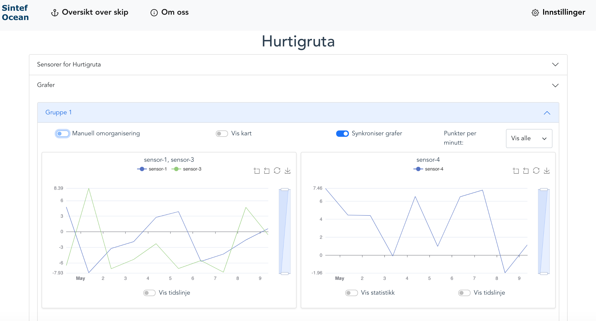

# VesselDataFrontend

Bachelor thesis written by Marius Torbjørnsen, Jan Loennechen and Michael S. Larsen in collaboration with SINTEF Ocean.

The project is a Vue 3 front-end application for visualizing vessel sensor data.

Graphing is done by Echarts and mock API is hosted by json-server.

## Preview



## Project setup
```
npm install
```

### Run project
```
npm run dev
```

### Compiles and minifies for production
```
npm run build
```

### Lints and fixes files
```
npm run lint
```

### Customize configuration
See [Configuration Reference](https://cli.vuejs.org/config/).
